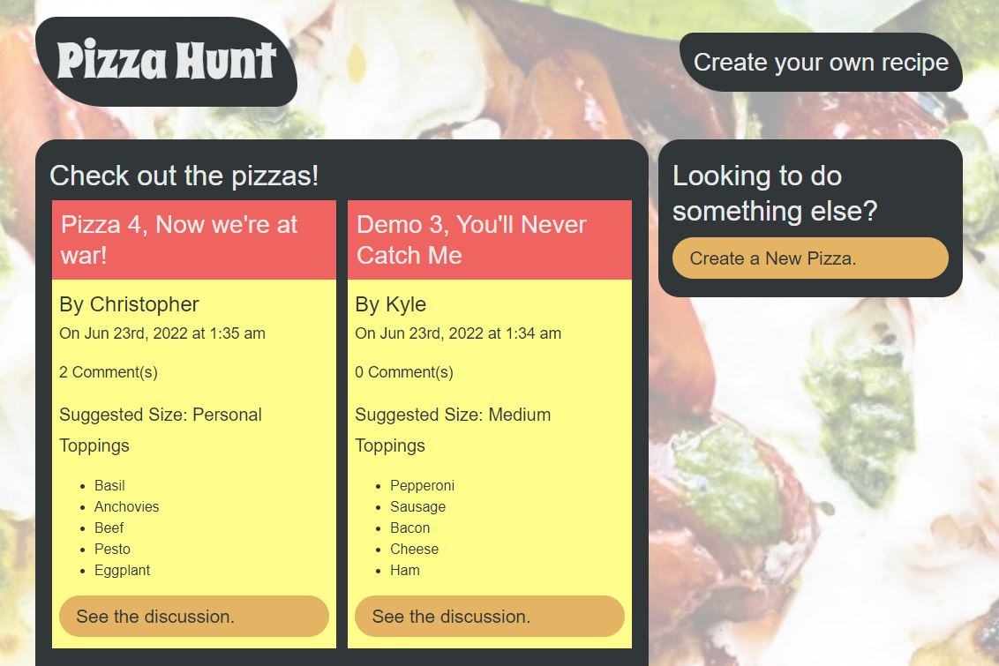

# Pizza Hunt

## Table-of-Contents

- [Description](#description)
- [Deployed Site](#deployed-site)
- [Features](#features)
- [Installation](#installation)
- [Technologies](#technologies)
- [Future Development](#future-development)
- [Credits](#credits)

## Description

Pizza Hunt is a full-stack application that uses MongoDB and Mongoose.js to create a social media recipe app where users can post their creative spins on pizza, add comments to recipes, and create threads within comments.

## Deployed Site

Follow [this link](https://intense-retreat-40554.herokuapp.com/) to view and use my site!

## Features

### Front-End Demonstration

This is how the front-end webpage appears to viewers. It is responsive, adapting to multiple screen sizes.

The homepage shows all of the pizzas that users have posted to the site, showing in order from newest to oldest. If users click the "Create a New Pizza" button on the right hand side. They are then brought to a page hosting a form. Users can fill out this form to create their own pizza recipe and post it to the site.

If they would like to view the discussion for a particular pizza, users click the "See the discussion" button at the bottom of the pizza card. This brings the user to a page where they can view the pizza details on the left of the screen. They can use the form on the right hand of the screen to leave a comment. Other users can then reply to that comment as well.

 

### Back-End Demonstration

To see all of the back-end functionality, you need to install it to your local machine. For instructions on how to do so, please see the [Installation](#installation) section.

Using a GET request to the api endpoint `localhost:3001/api/pizzas` will return all pizzas in the database. If you send a GET request to the api endpoint `localhost:3001/api/pizzas/[pizza_id]` using the ID of the pizza you are searching for, you will retrieve information for the pizza with the specified id.

Navigate to the api endpoint `localhost:3001/api/pizzas/`. Using a POST request from here will allow you to create a new pizza, as long as you input all of the necessary fields of information. This method requires that your data looks like this, where any name in brackets is adjusted to include the values you intend.

    {
        "pizzaName": "[pizza_name]",
        "createdBy": "[user_name]",
        "size": "[Pick one: "Personal", "Small", "Medium", "Large" or "Extra Large"]",
        "toppings": [
            "[topping_name]"
        ]
    }

Users can also use a PUT request to the api endpoint `localhost:3001/api/pizzas/[pizza_id]` using the ID of the pizza you wish to edit in order to update that pizza's information. If they use a DELETE request at this endpoint, it will delete that pizza from the database.

Navigate to the api endpoint `localhost:3001/api/comments/[pizza_id]`. Using a POST request from here will allow you to create a new comment attached to the pizza id you specified, as long as you input all of the necessary fields of information. This method requires that your data looks like this, where any name in brackets is adjusted to include the values you intend.

    {
        "writtenBy": "[user_name]",
        "commentBody": "[comment_body_text]"
    }

Users can also use a PUT request to the api endpoint `localhost:3001/api/comments/[pizza_id]/[comment_id]` using the ID of the pizza, comment, and reply in order to create a reply to an existing comment. The JSON data they input must match the following pattern:

    {
        "writtenBy": "[user_name]",
        "commentBody": "[comment_body_text]"
    }

If they use a DELETE request at the same endpoint, it will delete that comment from the database. Users can also use a DELETE request to the api endpoint `localhost:3001/api/comments/[pizza_id]/[comment_id]/[reply_id]` to delete the specified reply from the database.

## Installation

Although this application is deployed to a website, the front-end does not utilize all of the api's functionality. If you wish to view or test the routes, you can also install it to your local computer.

1. Open the command line interface.
2. Clone the repository onto your local machine using the `git clone` command.
3. Once the repository has been cloned, navigate into the root directory of the application using the command `cd Pizza-Hunt`.
4. Run the command `npm install` to install necessary packages and dependencies.
5. Once the dependencies have been properly installed, enter the command `npm start` to initiate the application and start the connection to the database.

For further help with installation, please refer to the below demonstration video.

 Here's a <a href="https://drive.google.com/file/d/1qyfim__s-QG4CCaNJktD9zR-dDs6rFMr/view" target="_blank">link</a> to the video version of the above gif.

## Technologies

- HTML
- CSS
- JavaScript
- Node.js
- npm
- Express.js
- MongoDB
- [Mongoose.js](https://mongoosejs.com/)

## Future Development

In the future, I would like to add the following improvements:

- More front-end functionality that utilizes all of the routes set up in the API.
- A user-authentication system where users can sign in for personalized views of the site.
- A way for users to save their favorite recipes under a separate menu that they can come back and view anytime.

I'm always interested in refactoring code to improve it's functionality. If you would like to suggest your own improvements, you can reach me at the links below.

- <a href="mailto:ashleylynnsmith.dev@gmail.com">Email</a>
- <a href="https://github.com/ashlynn4567">GitHub</a>
- <a href="https://www.linkedin.com/in/ashley-lynn-smith/">LinkedIn</a>

## Credits

This project was built with the help of the University of Oregon's Coding Boot Camp.

## Licensing

The application is covered under the following license: [MIT](https://opensource.org/licenses/MIT)
